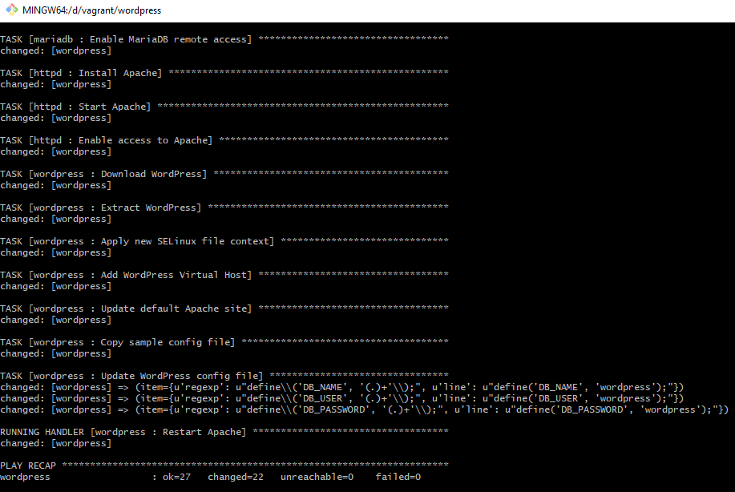
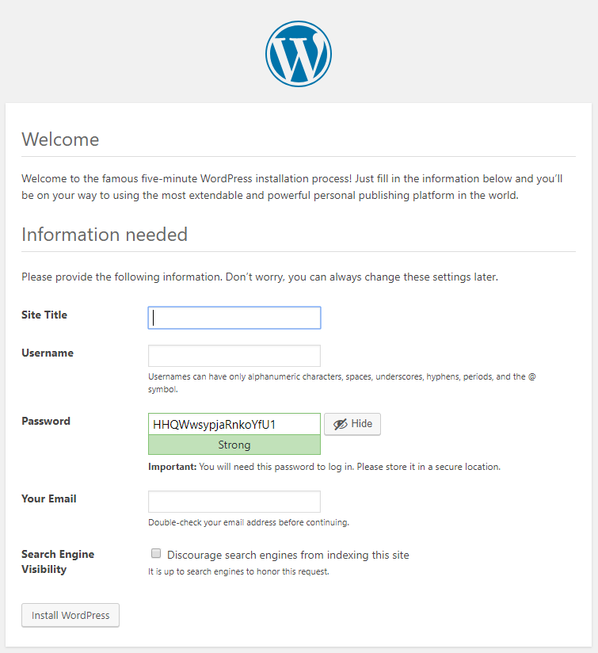

# Autmatically provisioning WordPress

I recently went mad and decided to install Windows 10 on my laptop, which had Fedora Linux since I acquired it back in 2015.
I lack of knowledge and experience with Windows, but I decided to build something similiar to my previous demos, which is an automated solution to provision a virtual machine and set it up from the ground up, installing and configuring all needed dependencies to get [WordPress](https://wordpress.org/) up and running.

>[WordPress](https://wordpress.org/) is a free and open-source content management system based on PHP and MySQL. Features include a plugin architecture and a template system. It is most associated with blogging but supports other types of web content including more traditional mailing lists and forums, media galleries, and online stores.

Usually, my demos are based on Fedora, Vagrant and Libvirt. This new demo will be a little bit different and the used components here are: [Windows 10](https://www.microsoft.com/software-download/windows10), [Vagrant](https://www.vagrantup.com/) and [Virtualbox](https://www.virtualbox.org/)

## Project structure

This project is structured in way to maintain the GoCD YAML pipelines, also some ansible playbooks used for deployment and testing:

```bash
$ tree.com .
Folder PATH listing for volume data
Volume serial number is B2B2-7D34
D:\VAGRANT\WORDPRESS
└───provisioning
    └───roles
        ├───common
        │   └───tasks
        ├───httpd
        │   └───tasks
        ├───mariadb
        │   └───tasks
        └───wordpress
            ├───files
            ├───handlers
            └───tasks
```

## Prerequisites

Before you start with this demo, you need to make sure you have installed [Vagrant](https://www.vagrantup.com/) and [Virtualbox](https://www.virtualbox.org/). Another used tool is the Apple implementation of mDNS which I often use on linux since it is supported by default. Unfortunatelly this is not the case on windows. Because of that I had to dig into how to automatically resolve local names on windows and I figured out Apple did it already and the tool is called "Bonjour".

You may find the Bonjour SDK for windows [here](https://developer.apple.com/bonjour/), after installing it, as always on windows, restart your computer before you proceed.

## Checking out this code

You may choose your preferred git client, I decided to for the official [git-scm](https://git-scm.com/) client. Then just clone this project opening the "git bash" terminal.

```bash
$ git clone https://github.com/fabiogoma/wordpress.git
$ cd wordpress
$ vagrant up
```

## Getting access to WordPress

After the Ansible provisioning, you will get a result similar to the one below: 

<p align="center">
  
</p>

Now check on your browser the WordPress url at: http://wordpress.local (This fancy url is possible due to the usage of [Bonjour](https://developer.apple.com/bonjour/))

<p align="center">
  
</p>

From now on, check any WordPress tutorial and follow the steps on how to use it.